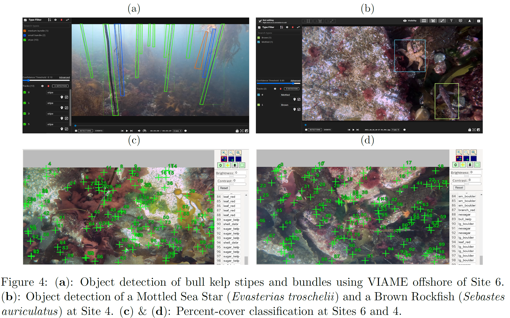

# CCR analytical resources 

## Overview

This is a public repository to organize information pertaining to the analysis and visualization of ROV telemetry, spatial data, and preliminary AI analyses of species, taxa, and substrate type via [CoralNet-Toolbox](https://github.com/Jordan-Pierce/CoralNet-Toolbox) and [VIAME](https://www.viametoolkit.org/wp-content/uploads/2020/09/VIAME-AI-Workshop-Aug2020.pdf). 
Our overarching objective here is to provide an open-source location in which we store code and resources necessary for other entities or individuals to reproduce our ROV telemetry and sensor file management and AI image analyses. 

For more general information about this ROV project including summary documentation, ROV videos, and photos from its deployment, see our main GitHub repo [Seattle_Aquarium_CCR_Coastal_Climate_Resilience](https://github.com/Seattle-Aquarium/Coastal_Climate_Resilience) 

To see active areas of develop where we are seeking assistance with software and analytical development, see the 1-page projects descriptions found at [Seattle_Aquarium_CCR_development](https://github.com/Seattle-Aquarium/CCR_development) 

## GitHub resources

We are fortunate to be working with [Clyde McQueen](https://github.com/clydemcqueen), who’s assisting with a variety of software aspects of our project, including the development of custom software to enable “terrain following” (dubbed surftrak), where the ROV auto-adjusts its altitude over varying seafloor based upon readings from the Ping Sonar Altimeter. The following table lists out multiple open-sources resources Clyde has developed.

<table>
<tr> <td> <a href="https://github.com/clydemcqueen/ardusub_surftrak"> <b> ardusub_surftrak </b> </a> </td> <td> A range hold flight mode enabling the ROV to autonomously maintain a set altitude above the seafloor </td> </tr> 
<tr> <td> <a href="https://github.com/clydemcqueen/surftrak_fixit"> <b> surftrak_fixit </b> </a> </td> <td> A BlueOS extension that can diagnose and fix common surftrak problems </td> </tr> 
<tr> <td> <a href="https://github.com/clydemcqueen/wl_ugps_external_extension"> <b> wl_ugps_external_extension </b> </a> </td> <td> A blueOS extension that listens for NMEA messages from our GNSS Satelitte Compass and feeds those data to our USBL system </td> </tr> 
<tr> <td> <a href="https://github.com/clydemcqueen/ardusub_log_tools"> <b> ardusub_log_tools </b> </a> </td> <td> A collection of log analysis tools for working with ArduSub vehicles </td> </tr> 
<tr> <td> <a href="https://github.com/clydemcqueen/wl_ugps_acoustic_analysis"> <b> wl_ugps_acoustic_analysis </b> </a> </td> <td> Test results from capturing and processing acoustic data from WaterLink's USBL system </td> </tr> 
</table>

## Analytical resources

* Code can be found [here](https://github.com/zhrandell/Seattle_Aquarium_ROV_telemetry_imagery_analysis/tree/main/code).

* Megan Williams, Seattle Aquarium Research Scientist, is leading the expansion of [this](https://experience.arcgis.com/experience/b11daaa83ff045f1a9d88b2b926e1f75) existing bull kelp habitat suitability model. A draft web version of our expanded habitat suitability model can be found [here](https://experience.arcgis.com/experience/17d4311a53454108a1196b90bd236547/page/Map/).

* To view all code and resources necessary to simulate ROV-derived data (i.e., to simulate data from CoralNet and VIAME), see [Seattle_Aquarium_CCR_benthic_taxa_simulation](https://github.com/Seattle-Aquarium/CCR_benthic_taxa_simulation).

* As an example of our manual annotations in VIAME for invertebrates and fish from the downward-facing ROV camera, see [here](https://viame.kitware.com/#/viewer/65f9a6c9481fe4ee851404f1).

* As an example of our manual annotations in VIAME of bull kelp stipes from the forward-facing ROV camera, see [here](https://viame.kitware.com/#/viewer/6650f76027e66d3c73937562).

* To view the 66 percent-cover categories of red, green, & brown algae, substrate types, sessile and mobile invertebrates, and fishes that we have created in CoralNet, view [this](https://github.com/zhrandell/Seattle_Aquarium_CCR_analytical_resources/blob/main/documents/CoralNet_Classifications.xlsx) *.xlsx* document (click "view raw" or "download").

* Our AI analyses are actively under development. More information about our desired future functionality can be found at [Seattle_Aquarium_CCR_development](https://github.com/Seattle-Aquarium/CCR_development/tree/main), specifically at the 1-page project descriptions [KelpNet](https://github.com/Seattle-Aquarium/CCR_development/blob/main/1-pagers/KelpNet.md) and [bull_kelp_tracking](https://github.com/Seattle-Aquarium/CCR_development/blob/main/1-pagers/bull_kelp_tracking.md)

  
  
   

