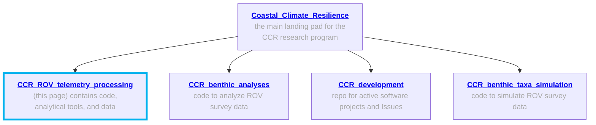
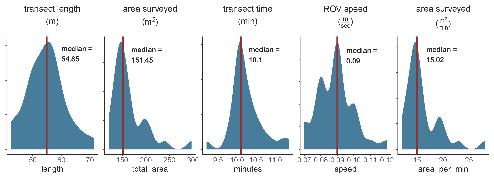
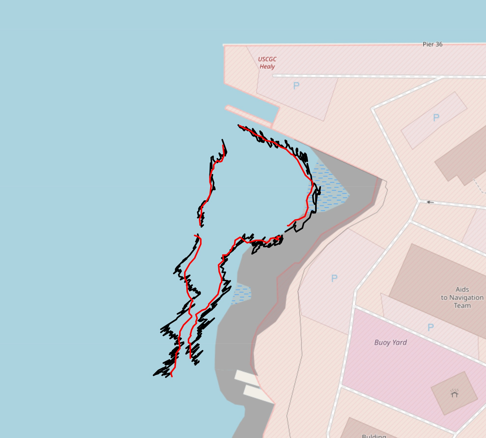
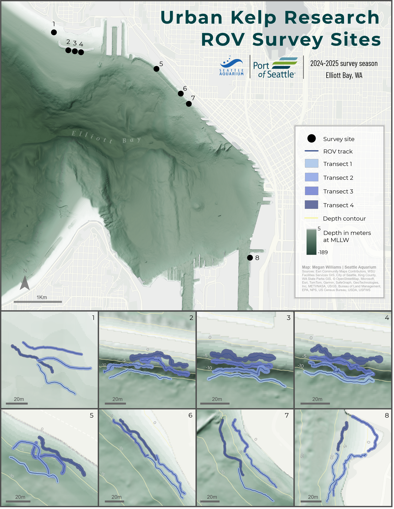

# CCR ROV telemetry processing

## Overview

This repository contains code and files to organize information pertaining to the analysis and visualization of ROV telemetry, spatial data, and preliminary AI analyses of species, taxa, and substrate type via [CoralNet-Toolbox](https://github.com/Jordan-Pierce/CoralNet-Toolbox) and [VIAME](https://www.viametoolkit.org/wp-content/uploads/2020/09/VIAME-AI-Workshop-Aug2020.pdf). 
Our overarching objective here is to provide an open-source location in which we store code and resources necessary for other entities or individuals to reproduce our ROV telemetry and sensor file management and AI image analyses. 

### other CCR GitHub repositories

## Telemetry processing

### Code 
* `tlog_csv_no_EKF.py`: This script processes telemetry `.tlog` files from BlueOS when there is no fusion between the GPS and Doppler Velocity Log (DVL). It extracts relevant fields (e.g., time, date, GPS latitude/longitude, DVLx, DVLy (`LOCAL_POSITION_NED`), altitude, depth, heading) and averages values per second. Additionally, it calculates DVL-based latitude and longitude (`DVLlat`, `DVLlon`) from DVLx and DVLy movements and estimates the width (m) and area (m²) captured by GoPro images based on the ROV's altitude. If the survey start and end times are known, they can be specified when running the script; otherwise, the entire `.tlog` file will be processed.

* `tlog_to_csv_EKF.py`: This script processes `.tlog` files when GPS and DVL data are fused via an Extended Kalman Filter (EKF), producing more accurate tracks than using GPS or DVL alone. Instead of calculating `DVLlat`/`DVLlon`, this script incorporates the fused position data (`GLOBAL_POSITION_INT`) for improved accuracy.

   

* `transect_map.py`: This script generates a Leaflet map displaying the ROV tracks as measured by different navigation sources: GPS (black), DVL (blue), and EKF (red).

   

---

## AI development 
We are developing machine learning models to analyze imagery collected during ROV surveys. This includes both percent-cover classification and object detection to identify key species and habitat features. Both classification and object detection models are being trained using Ultralytics via CoralNet-Toolbox. 

### Percent-cover classification:
* We have categorized **31 percent-cover classes**, including red, green, and brown algae, substrate types, sessile and mobile species. View our label set [here](https://www.dropbox.com/scl/fi/o2oxc0fen94m5o8x5a5el/percent_cover_labelset.xlsx?rlkey=kh8dlx9fpo9pz5wxnn8eaq5e4&dl=0).

  

### Object dection
* We are training an object detection model to automate identification of animals in survey imagery. Annotations to create the training the dataset are being created in VIAME thanks to our hardworking "AI Teacher" volunteers. View the species list [here](https://www.dropbox.com/scl/fi/v8k7ndggqiwn6cdxrfnyj/objects_labelset.xlsx?rlkey=p26n0qj0jekl5j0s0cbt2g1bj&dl=0).

  

 

### Get Involved! 
More information about our desired future functionality can be found at [Seattle_Aquarium_CCR_development](https://github.com/Seattle-Aquarium/CCR_development/tree/main), specifically at the 1-page project descriptions [KelpNet](https://github.com/Seattle-Aquarium/CCR_development/blob/main/1-pagers/KelpNet.md) and [bull_kelp_tracking](https://github.com/Seattle-Aquarium/CCR_development/blob/main/1-pagers/bull_kelp_tracking.md)

---

## Spatial analysis

* Megan Williams, Seattle Aquarium Research Scientist, is leading the expansion of [this](https://experience.arcgis.com/experience/b11daaa83ff045f1a9d88b2b926e1f75) existing bull kelp habitat suitability model. A draft web version of our expanded habitat suitability model can be found [here](https://experience.arcgis.com/experience/17d4311a53454108a1196b90bd236547/page/Map/).

* To view all code and resources necessary to simulate ROV-derived data (i.e., to simulate data for percent cover and abundance metrics), see [Seattle_Aquarium_CCR_benthic_taxa_simulation](https://github.com/Seattle-Aquarium/CCR_benthic_taxa_simulation).

  

## GitHub resources

We are fortunate to be working with [Clyde McQueen](https://github.com/clydemcqueen), who’s assisting with a variety of software aspects of our project, including the development of custom software to enable “terrain following” (dubbed surftrak), where the ROV auto-adjusts its altitude over varying seafloor based upon readings from the Ping Sonar Altimeter. The following table lists out multiple open-sources resources Clyde has developed.

<table>
<tr> <td> <a href="https://github.com/clydemcqueen/ardusub_surftrak"> <b> ardusub_surftrak </b> </a> </td> <td> A range hold flight mode enabling the ROV to autonomously maintain a set altitude above the seafloor </td> </tr> 
<tr> <td> <a href="https://github.com/clydemcqueen/surftrak_fixit"> <b> surftrak_fixit </b> </a> </td> <td> A BlueOS extension that can diagnose and fix common surftrak problems </td> </tr> 
<tr> <td> <a href="https://github.com/clydemcqueen/wl_ugps_external_extension"> <b> wl_ugps_external_extension </b> </a> </td> <td> A blueOS extension that listens for NMEA messages from our GNSS Satelitte Compass and feeds those data to our USBL system </td> </tr> 
<tr> <td> <a href="https://github.com/clydemcqueen/ardusub_log_tools"> <b> ardusub_log_tools </b> </a> </td> <td> A collection of log analysis tools for working with ArduSub vehicles </td> </tr> 
<tr> <td> <a href="https://github.com/clydemcqueen/wl_ugps_acoustic_analysis"> <b> wl_ugps_acoustic_analysis </b> </a> </td> <td> Test results from capturing and processing acoustic data from WaterLink's USBL system </td> </tr> 
</table>

