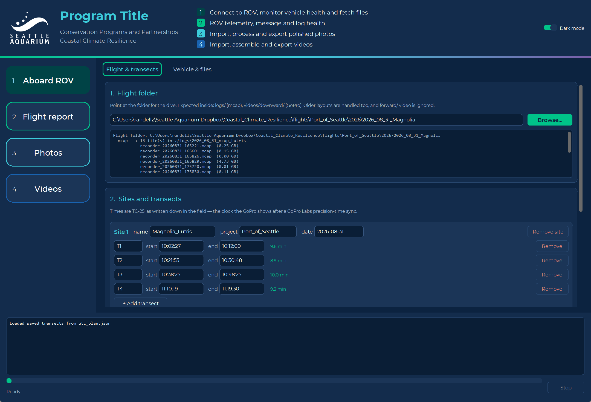
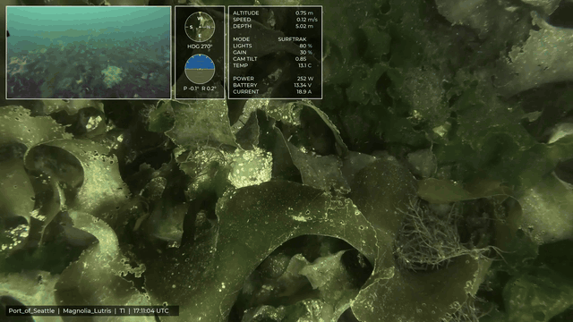
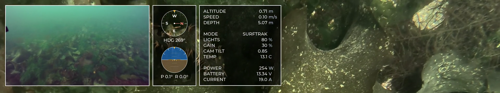
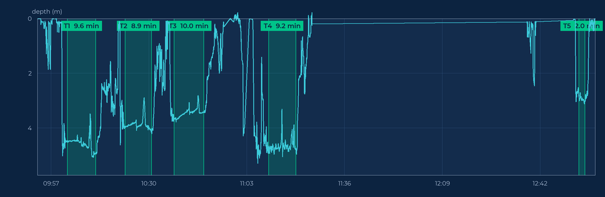
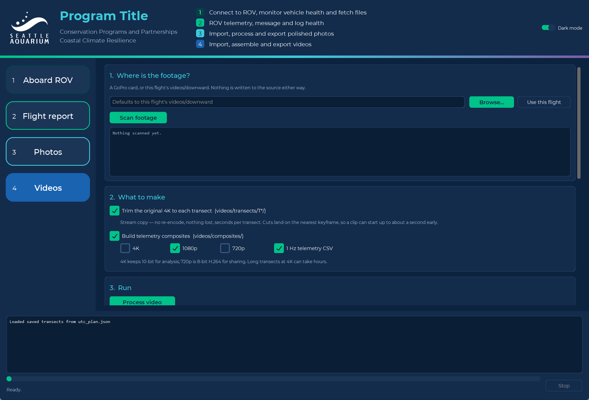

# Underwater Telemetry Compositing (UTC)

**One program for a whole ROV survey day.** Pull the recordings off the vehicle,
prove they are sound, cut the telemetry into analysis-ready CSVs, sort and
develop the imagery, and build the video — from one window, on a field laptop,
with nothing else to install.

<p align="center">
  
</p>

## Why this exists

The Seattle Aquarium's ROV survey method is not one technique, it is a chain:
fly the survey, get the recordings off the vehicle, prove they are intact, cut
the telemetry into per-transect CSVs, sort the stills, develop the raws,
composite the video. Every link in that chain existed here as its own thing — a
download by hand, an R script, a Python extractor, a Lightroom session driven
with a mouse, an ffmpeg incantation, and a folder convention that lived mostly
in one person's head.

Each piece worked. **The chain did not travel.** A group wanting to run these
surveys would have had to reassemble it from a repository and a conversation,
and the parts nobody had written down were exactly the parts that decide whether
the numbers mean anything: which clock a time is in, which sensor a depth came
from, what happens when a recording is truncated.

UTC is those pieces in one program, in the order a survey day happens:

| | |
|---|---|
| **Retrieve** | Ask the vehicle what it is and what it holds, check it is fit to dive, and copy the right recordings onto a drive you can carry home. |
| **Understand** | Cut the telemetry into per-transect CSVs, and say plainly when a recording, a clock or an instrument cannot be trusted. |
| **Photos** | Card to transect folder, raw development, telemetry banner. |
| **Video** | Per-transect trims, telemetry composites, and short clips for a talk. |

Two consequences, and both are the point.

**Nothing is typed twice.** The transect times entered once on the first screen
drive the CSVs, the imagery sorting, the dive-profile check and the video
overlays. Two copies of those times drifting apart is the kind of error that
only shows up when the analysis disagrees with the footage.

**It is one file.** A collaborator gets `Underwater-Telemetry-Compositing.exe`
and double-clicks it. No Python, no ffmpeg, no fonts, no timezone database, no
build step.

The aim is that another organisation can pick this up and *run* the method
rather than approximate it. What is not automated is written down, and where a
number is an estimate rather than a measurement, the file says so.

---

## What it does

Four chapters on a left-hand rail, in the order a survey day happens. Each
carries its own tools along the top of its own page, so the rail stays four
items long however many tools accumulate.

| Chapter | Tool | What it does |
|---|---|---|
| **1 · Aboard ROV** | **Flight & transects** | Create a flight's folders, then enter its transect times once. Draws a dive profile with the transects marked, so a mistyped time is obvious before anything is processed. |
| | **Vehicle & files** | Ask BlueOS what the vehicle is, check it is fit to dive, and copy the right recordings onto a portable drive. [Read-only](#aboard-the-rov) — nothing on the ROV is written to or deleted. |
| **2 · Flight report** | **Transects** | Cut the `.mcap` telemetry into [one CSV per transect](#transects-mcap-to-csv), plus a map of the site, and [report how the navigation behaved](#sensor-health). |
| | **Recording health** | Check each `.mcap` for damage, repair the ones the vehicle never closed, and — [when a recording is beyond saving](#when-a-recording-fails) — read telemetry from the autopilot's own `.BIN` log instead. |
| **3 · Photos** | **Import photos** | Pull stills off the camera card straight into transect folders, renamed and bannered. Copies from a card; moves from inside the flight. |
| | **Process photos** | Develop a folder of GoPro `.GPR` raws through Lightroom Classic: crop to the survey size, remove chromatic aberration, AI Denoise, export 16-bit ProPhoto TIFs. |
| | **Banner tools** | Add the telemetry banner to any folder of stills, later. |
| **4 · Videos** | **Video** | Trim each transect out of the original 4K, build the telemetry composites, cut short shareable clips, and put two flights side by side. |

---

## What a composite carries

The downward-facing GoPro from one transect, with telemetry from the BlueOS
`.mcap` drawn along the top of the frame. One video per transect.

<p align="center">
  
</p>

<p align="center">
  <sub><b>Magnolia, Port of Seattle — 31 August 2026, transect T1.</b>
  Flying SURFTRAK at 0.7 m above the seabed, 0.10 m/s, drawing about 250 W.
  Straight out of the tool, nothing added.</sub>
</p>

The overlay strip, at full resolution:

<p align="center">
  
</p>

Left to right:

1. **The ROV's own forward camera**, pulled out of the same recording — what the
   pilot was looking at while the downward camera recorded the seabed.
2. **A compass rose and a tilt indicator**, stacked: heading, then pitch and
   roll.
3. **A telemetry panel** — altitude, speed, depth, flight mode, light power,
   thruster gain, camera tilt, water temperature, and power draw.

The right half of the frame is deliberately left clear. A footer along the
bottom carries project, site, transect and the UTC timestamp, so a frame lifted
out of context still says where and when it came from.

Every value is read from the recording at that instant rather than interpolated,
and held forward from the last sample only up to a staleness limit — a sensor
that drops out goes blank rather than flat, because [a dead instrument must not
look healthy](#the-flight-telemetry-csv).

Alongside the composites, the same run writes a **1 Hz telemetry CSV** for the
whole flight — see [the two CSVs](#the-two-csvs) for which file is which.

---

## Running it

### For collaborators: nothing to install

Hand them **`Underwater-Telemetry-Compositing.exe`** and they double-click it.
There is nothing else to install — no Python, no ffmpeg, no fonts, no
timezone database. It is one self-contained file (~96 MB) carrying its own
copy of everything:

| bundled | why it has to be |
|---|---|
| Python 3.13 runtime | the whole point of the single file |
| ffmpeg (static) | every trim, composite and clip shells out to it |
| Montserrat | the Aquarium brand face, for the GUI and the photo banner |
| `tzdata` | Windows ships no IANA database, and without one every transect time resolves to the wrong instant |
| `pymavlink` | reads the autopilot's `.BIN` dataflash logs |
| `mcap`, `PyAV`, Pillow, NumPy, CustomTkinter | telemetry, video, imagery, GUI |
| the transect extractor, with pandas and SciPy | so the Transects page works from the executable, not only from source |
| `pywinauto` | AI Denoise has no scripting interface, so the RAW develop drives its panel through Windows UI Automation |

Requirements on their side:

* **Windows 10 or 11, 64-bit.** The build is Windows-only; macOS or Linux
  would need its own build from the same spec.
* **Disk space.** The app is small but its working cache is not — reading one
  dive writes several GB per flight under `%LOCALAPPDATA%`, and a 5 GB
  recording can produce ~12 GB of intermediates.
* **An NVIDIA GPU is optional.** UTC runs a two-frame trial encode to find out
  whether NVENC really works and falls back to the CPU encoder when it does
  not — it is a speed difference, not a requirement.
* **Lightroom Classic, for one tool only.** *Process photos* drives a real
  Lightroom installation — it is the only thing UTC cannot bring with it.
  Every other chapter works without it.
* **First launch shows a SmartScreen warning**, because the executable is not
  code-signed: *More info* → *Run anyway*. Tell partners to expect this, or it
  reads as the file being unsafe.

If a partner reports trouble, have them run the build's own health check:

```
Underwater-Telemetry-Compositing.exe --selftest
```

It verifies the bundled ffmpeg, fonts and timezone database, that `pymavlink`
and the transect extractor import, and that overlay rendering really does run across processes — then
writes the result to `%TEMP%\utc_selftest.txt` for them to send on. A windowed
build discards stdout, so the file is the point.

The same build will also report what a vehicle offers, read-only, which is how
[the ROV side](#aboard-the-rov) gets built against what BlueOS actually serves
rather than against a guess:

```
Underwater-Telemetry-Compositing.exe --probe-rov report.txt
```

### For development

Double-click **`run_UTC.bat`**. Nothing needs installing first beyond Python
3.10 or newer: on its first run the launcher builds a private environment in
`%LOCALAPPDATA%\CCR_ROV\venv`, installs UTC and the transect extractor into it,
and starts the app. That takes a few minutes once; after that it opens straight
away.

The environment sits outside the repo deliberately — this checkout lives in a
OneDrive folder, and a virtualenv there would be thousands of files for the sync
client to chew through forever. `run_MCAP_to_CSV.bat` shares the same
environment, so whichever runs first does the work.

The launcher tests each Python it finds rather than taking the first one on
disk. A partial install still leaves a `python.exe` that cannot find its own
standard library, and choosing it produces a misleading `_tkinter` DLL error
rather than an obvious "this Python is broken".

From a terminal instead:

```
python -m pip install -e .
python -m utc.gui.app
```

`ffmpeg` does not need installing separately — the `imageio-ffmpeg` wheel ships
a static build. A real ffmpeg on `PATH` is used in preference if present.

### Building a standalone .exe

```
python -m pip install pyinstaller
pyinstaller utc.spec
```

Produces `dist/Underwater-Telemetry-Compositing.exe` (~96 MB), which needs no Python install
and can be handed to a colleague directly. Windows SmartScreen will warn about
an unsigned executable the first time: *More info* → *Run anyway*.

The build output is **git-ignored**; do not commit it.

Two things about the build worth knowing:

* The spec targets `launch.py`, not `utc/gui/app.py`. PyInstaller runs its
  target as `__main__`, so aiming it at the module breaks that module's relative
  imports (`attempted relative import with no known parent package`). A
  top-level script that imports the package keeps the package context intact.
* A windowed build discards stdout and stderr, so a startup failure leaves no
  trace whatsoever. Build a console variant to find out why:

  ```
  set COMPOSITE_DEBUG=1
  pyinstaller utc.spec
  dist\Underwater-Telemetry-Compositing-debug.exe
  ```

---

## Aboard the ROV

*Vehicle & files*, the second tool in chapter 1. It talks to BlueOS on the ROV's
Raspberry Pi over the tether, and it exists because three separate field
failures came from choosing recordings by hand: a flight whose covering
recording was never downloaded, a 6.7 GB file from a previous day pulled in
because BlueOS had rewritten its modification time, and a stray recording from
six weeks earlier sitting in a folder. UTC already knows the transect times and
can read an mcap's true span in well under a second, so it can pick the right
files itself.

> **Everything here is read-only.** GET requests only — no deletes, no writes to
> the vehicle, not even to read its parameters. Freeing space on the Pi stays a
> deliberate act in BlueOS's own interface. A test walks every call that touches
> the vehicle and asserts the method was GET every time; the token File Browser
> hands out carries create, modify and delete rights, and nothing here uses
> them. A bug that destroys the only copy of a dive is the one failure this
> programme must not have.

The API is **discovered, not assumed**. BlueOS moves between releases and
extensions register themselves at runtime, so the probe walks what the vehicle
actually offers and reports it. Run it beside a vehicle and send the report on:

```
Underwater-Telemetry-Compositing.exe --probe-rov report.txt
```

### The vehicle, by name

Connect returns **every** address that answers, each with the name it calls
itself, and every report leads with the name rather than the address. That is
not decoration. On one dock day Nereo on the tether and a fixed camera on the
wifi both answered to the hostname `blueos`, and whichever replied first won —
nothing downstream would have noticed, because it listed recordings, they looked
plausible, and they were the wrong vehicle's.

### Before the dive

Four things worth knowing while the ROV is still on deck. A recorder that fills
mid-transect does not warn anyone: it stops.

| Checked | Why it is on this screen |
|---|---|
| **Free space**, against the minutes you plan to record | The one that ends a dive early, and the one nobody thinks to look at. |
| **SoC temperature**, with its high-water mark | Throttling starts near 80 °C. One vehicle measured 55 °C sitting idle with a 59.9 °C peak — comfortable, but only because it was measured. |
| **Throttle events** already in the Pi's own log | Whether it has *been* throttling, which the current temperature does not tell you. |
| **Clock skew** against this laptop | See below. |

**The Pi's clock can be days wrong, silently.** It has no battery-backed clock,
so it restores the last time it knew at boot and stays there. One backup vehicle
was found **8.09 days behind**, sitting exactly on the date of its last flight.
Recordings are stamped with that clock and their filenames come from it, so a
dive flown in that state files under the wrong date and can collide with a real
earlier flight. This matters most on the spare vehicle — the one that sits
unpowered for weeks and then gets pressed into service. The skew corrected
itself to −6 seconds while the operator had the BlueOS web interface open, which
appears to be what syncs it, so the check reports the number and says plainly
what a large one means.

### Which recordings, and where they go

Recordings are listed by their **recorded span**, not their modification time,
and each is labelled with the transects it covers. The span comes from the
file's first 96 KiB over an HTTP range request — about 75 ms per file against
the minutes a full download costs. All 26 recordings on one vehicle resolved
their spans in half a second, and the estimated end time landed within two
seconds of the file's own timestamp.

Writing **straight to a portable SSD** is the point of the destination half. The
workflow it replaces crosses a marginal network twice: Pi to laptop, laptop to
Dropbox over a MiFi hotspot, then down again onto a different machine. It also
works on the days the hotspot does not.

The destination is checked **before** anything is fetched, and files are
verified **after** they land:

* **FAT32 cannot hold a recording of 4 GiB or more**, however much room the
  drive reports free — two of this programme's own recordings are past it
  (4.94 and 4.41 GiB). The failure presents as a permissions problem rather
  than a size one, which is exactly how it turned up in the field.
* Free space, file system and writability are all settled first, leaving 512 MB
  of headroom rather than filling a volume to the last byte.
* Each file is checked by size and by reading its header back. A copy that ran
  out of drive halfway is worse than one that never started, because it looks
  finished.

The drive is laid out as `flights/<date>_<site>/logs`, so it drops straight into
Dropbox later.

### A snapshot of what the vehicle was

**Save a snapshot** writes `logs/vehicle_snapshot.json` into the flight's own
folder, so it travels with the data. Behaviour has already changed underneath
this programme twice — the recorder's repair sweep rewriting old files, and a
BlueOS beta — and tying a data anomaly to a version change is straightforward
with this and close to impossible without it.

It records BlueOS, ArduSub and its vehicle type, the flight-controller board,
every installed extension with its tag and whether it is enabled, and the
running containers with their image tags — which is not the same question, since
an extension can be updated and not restarted. Plus disk, temperature, throttle
history and clock skew at dive time. Against a live vehicle: 12 seconds, 42 KiB.

**The parameters come from the autopilot's own flight log, not from asking the
vehicle.** Asking would mean sending `PARAM_REQUEST_LIST` — a write to the
vehicle bus. ArduPilot writes the complete parameter set into the head of every
dataflash log it keeps, so a GET reads it instead, and that turns out to be the
better source on every count:

* it is the set **as flown** for a given flight, not as currently configured;
* it is **retrospective** — one vehicle was holding 80 logs going back to 2025,
  so "what did we change, and when?" is answerable for flights that happened
  long before this code existed;
* it is **cheap**: the block sits at the head, so 512 KiB and a third of a
  second gets all 1,014 parameters, against 78 MB for the largest whole log.

The snapshot also carries what this flight changed from the one before it. On
one vehicle that immediately distinguished two kinds of change: log 79 to 80
moved eleven values — stream rates, barometer ground pressure — while 78 to 79
moved 279 with parameters appearing and disappearing, which is the signature of
a firmware change rather than somebody turning a knob. An absent parameter is
reported as `null` rather than unchanged, on purpose, so those two cases cannot
be confused.

> A folder can also stand in as the source — a mounted share, or last dive's
> logs — so the selection and verification path is usable without a vehicle
> present.

---

## The flight, and its transects

The first tool in chapter 1, and the one everything downstream is named from.
Two steps: say which folder this dive lives in, then write down its transect
times — once.

### The flight folder

Point the app at the folder for one dive. The expected layout is:

```
2026_08_24_Centennial/
    logs/                 recorder_*.mcap
    photos/
    videos/
        downward/         GoPro MP4s   <- composited
        forward/          GoPro MP4s   <- ignored
```

Older layouts (`video/`, `downward/video/`, mcaps loose in the root) are
recognised too. Whatever it finds is listed in the panel — **read it before
running.** Compositing the wrong camera is an expensive mistake to discover an
hour into an encode, so discovery reports rather than assumes.

Several mcaps per flight is normal (BlueOS rolls a new file each time recording
restarts); they are merged onto one timeline in chronological order.

### Sites and transects

Add a site (name, project, date), then its transects. Times are **TC-25** —
the clock the GoPro displays after a
[GoPro Labs precision time](https://gopro.github.io/labs/control/precisiontime/)
sync, as written down in the field. `hh:mm:ss`; the duration is shown as you
type, and obviously wrong entries are flagged.

Multiple sites per flight folder are supported.

Entries are saved to `utc_plan.json` in the flight folder and reloaded
automatically next time, so a re-run at a different resolution needs no retyping.

**Check them before anything is processed.** *Draw the dive profile* reads the
flight's depth against time and shades the transect windows onto it. Every band
should sit on a flat stretch of seabed; one that lands on a descent, an ascent
or a surface interval is a time typed wrong, and this is the last cheap moment
to find that out — before imagery is filed and a card is wiped.

<p align="center">
  
</p>

<p align="center">
  <sub>Five transects across a three-hour recording. Note how much of the dive
  is <em>not</em> transect — which is exactly why
  <a href="#give-it-the-transects">the sensor-health report is given the
  windows</a> rather than judging the whole file.</sub>
</p>

> Transect names must be **unique across the whole plan**, not just within one
> site, and a reused name is now rejected by validation. Imagery is filed by
> transect name alone, so two sites that both call a transect `T1` land in one
> folder and cannot be told apart afterwards — which happened on 2026-08-31 with
> two ROVs flown the same day. If a second vehicle flew, number its transects
> onward (`T5`) rather than restarting at `T1`.

---

## The flight report

Chapter 2 is the desk afterwards: what the recordings say, and whether they can
be believed. Two tools, and a third report inside the first.

| Tool | Answers |
|---|---|
| **Transects** | What the telemetry says — [one CSV per transect](#transects-mcap-to-csv), a map of the site, and [how the instruments behaved](#sensor-health). |
| **Recording health** | Whether the `.mcap` *file* is intact, [what to do when it is not](#when-a-recording-fails), and how to fall back to [the autopilot's own log](#reading-the-autopilots-own-log). |

### Transects (mcap to CSV)

The **Transects** page runs the extractor in [`mcap_to_csv/`](../mcap_to_csv/)
against the flight that is already open. It reads the survey plan from
*Flight & transects* and the recordings from the flight folder, so the transect windows are
typed once and drive both the CSVs and the video overlays — two copies of those
times drifting apart is the kind of error that only shows up when the analysis
disagrees with the footage.

It writes one CSV per transect plus a Leaflet map of the site. Column meanings
and provenance are in [COLUMNS.md](../mcap_to_csv/COLUMNS.md).

`run_UTC.bat` installs the extractor alongside UTC. If the page reports it
missing, install it by hand:

```bash
python -m pip install -e ../mcap_to_csv
```

---

## Photos

Chapter 3, three tools: bring it in, work it up, get it out.

### Import

One page covers both routes, because they are the same job with a different
source:

* a **GoPro card** — frames are *copied*, so the card keeps its originals until
  the operator chooses to reformat it;
* the flight's own `photos/GPR` and `photos/JPG` — frames are *moved*, because
  they are already inside the flight and a second copy is waste.

Which one applies is decided by **where the source sits, not by a toggle**, so
the safe behaviour cannot be switched off by accident. Frames are filed into
transect folders by their capture time against the survey plan, renamed so a raw
and its preview stay paired, and stamped with the telemetry banner. See
[Folder structure](#folder-structure) for the naming and for why `JPG_edited` is
never written to.

### Develop the raws

*Process photos* takes one folder of `.GPR` raws and produces delivery TIFs in a
`TIF` folder beside it — a **sibling, never a child**, so the exports are not
picked up by anything that scans the raw folder, including this feature's own
next run.

| Step | Setting | Why it is fixed |
|---|---|---|
| Crop | **4606 × 4030 px** | Fixed by the survey protocol, not by the camera. |
| Lens | chromatic aberration removed | — |
| Denoise | **AI Denoise, amount 50** | The protocol's value; the step that claims the machine. |
| Export | **16-bit ProPhoto RGB TIF** | Delivery format for downstream analysis. |

The recipe is **not adjustable**. Crop size, colour space and bit depth are set
by the survey protocol rather than by taste, so they are stated rather than
offered; the only two choices that change the outcome for an operator are
whether to run Denoise and what to do about TIFs that already exist.

**Check comes before Develop.** A run takes the machine away for the best part
of an hour, so nothing about it should be discoverable only by trying it. Check
reads the frame sizes, looks for Lightroom and measures the disk, and prints
what it found in the same box the run's problems appear in — by the time the
confirmation dialog opens, its numbers have been on screen once already.

Three things are worth knowing about how this is driven, because they are all
consequences of what Lightroom does and does not expose:

* **The crop arithmetic is pure, and tested on its own.** Lightroom stores a
  crop as four fractions of the uncropped frame, rounds to nearest, and writes
  six decimal places back to the catalog — so six is what the plan is computed
  against. A rectangle one pixel out is indistinguishable from a correct one
  until 179 TIFs have been written.
* **AI Denoise has no scripting interface**, and as of Lightroom Classic 14.5 no
  batch entry point either. A develop preset carrying a Denoise filter *looks*
  like a way to script it and is not: it sets the flag without computing
  anything, and the export comes out bit-identical to un-denoised. So UTC does
  what an operator does — develop one photo in the Detail panel, then Sync the
  settings across the folder: one panel interaction and one dialog, whatever the
  size of the batch.
* **Every step is verified against the catalog, not the screen.** Denoise writes
  a per-photo record and the run waits for it, so a click that appeared to work
  but did nothing is caught. Anything unreachable raises rather than quietly
  exporting un-denoised frames and calling it done, and each run dumps the
  control trees it walked, so a panel that has moved again names itself.

### Banner tools

The telemetry banner applied to any folder of stills, after the fact — for
imagery that was imported before a plan existed, or corrected and re-exported
later. It refuses to stamp a folder twice.

---

## Video

Chapter 4. Two jobs at very different speeds, deliberately on one page but
chosen separately:

* **Trim** is an ffmpeg stream copy — no re-encode, nothing lost, seconds per
  transect. It gives you the untouched 4K for exactly the survey window.
* **Composite** decodes, draws [the telemetry overlay](#what-a-composite-carries)
  and re-encodes. Minutes to hours.

Either can be run now or months later by pointing at a flight whose footage is
already in `videos/downward`, so a rushed field day can dump the card and leave
the slow work for a desk. Nothing is written to the source footage either way.

### What it writes

Tick any combination of 4K / 1080p / 720p. Videos land in
`videos/composites/`, named:

```
YYYY-MM-DD_project_site_transect_resolution.mp4
2026-08-24_HSIL_Centennial_T1_1080p.mp4
```

The 1 Hz CSV lands in `logs/`.

### How long it takes, and where the time goes

Measured on a 20-core laptop, one 10-minute transect (3,600 overlay frames):

| overlay workers | wall clock | frames/s | vs one core |
|---|---|---|---|
| 1 | 613.8 s | 5.9 | — |
| 4 | 176.0 s | 20.5 | 3.5× |
| 8 | 158.6 s | 22.7 | 3.9× |
| 12 *(default)* | 115.7 s | 31.1 | **5.3×** |
| 16 | 103.3 s | 34.8 | 5.9× |

Drawing the overlay was the pipeline's only serial stretch — ffmpeg already
uses every core when it encodes, and the trims are stream copies bound by the
disk. Panels are now drawn across processes: telemetry is sampled and footers
formatted in the parent, so workers receive plain data and neither the
telemetry store nor the caller's footer callback has to be picklable.

The default leaves two cores free (capped at 12) because a run lasts tens of
minutes and the machine is normally still in use. Override with
`AppConfig.overlay_workers` or the `UTC_OVERLAY_WORKERS` environment variable.
Scaling is well short of linear — past a dozen workers, PNG compression and the
disk take over — so 16 buys little over 12 while making the laptop sluggish.

Sequences under 400 frames stay on one process: starting a pool costs more than
it saves. If a pool cannot start at all, the run falls back to one core and
says so rather than failing.

> Parallel and serial output is verified byte-identical, frame for frame — a
> composite must not depend on how many cores drew it.

**Trimming is deliberately not parallelised.** It is an ffmpeg stream copy: one
flight wrote 9.19 GB across three transects in about 24 seconds, roughly
400-500 MB/s, which is the disk's limit rather than the CPU's. Running them at
once would divide that bandwidth, not multiply it.

### While a run is going

A full flight is tens of minutes of encoding, so two things are worth knowing.

**Sleep.** Windows does not count a working process as user activity, so a
laptop left alone will idle-sleep mid-encode and the run pauses until it wakes.
On one test run that cost 55 minutes and looked exactly like a hang. The tool
now asks Windows to stay awake while it works. **Closing the lid still sleeps
the machine** — no program can override that — so leave the lid open on a long
run. The screen is allowed to switch off, which is fine.

**Files open elsewhere.** Outputs are written into a Dropbox folder, so
something else may be holding the file the tool is about to replace: Dropbox
uploading the previous version, antivirus, or Excel with the last run's CSV
still open. The tool waits for the lock to clear and says so. If it never
clears, it writes `…(1).mp4` alongside rather than throwing away the encode, and
tells you to close the other program.

### Short clips, and two flights side by side

Two more things on the Video page, both of which write into the flight rather
than out of it.

**A short clip from one video** — a lingcod for a talk, a holdfast for a post.
Deliberately a different job from a transect trim, and a different module:

| | Transect trim | Moment clip |
|---|---|---|
| what it is | **evidence** | **communication** |
| cut on | TC-25 clock time | offsets into one file (`6:40`) |
| encoding | stream copy, never re-encoded | re-encoded, so the cut lands on the frame asked for |
| lands in | `videos/transects/T*/` | `videos/clips/` |

Any combination of 1080p, 720p, a web-optimised "social" rendition, and an
animated GIF. The GIF is 480×270 at 10 fps and costs roughly 0.8 MB per second —
GIF stores every frame whole, so the tool reports the size afterwards and
suggests the MP4 instead when it has run away.

**Two videos side by side** answers a question the separate recordings cannot:
how much of the difference between two flights is the lighting rig and how much
is the seabed. Put one vehicle next to the other over the same site and the
comparison is direct.

Either side may be a video file *or* a folder of mcaps — the ROV's forward
camera — and the two need not match. The awkward part is time, because the
sources do not share a clock:

* an **mcap** carries an absolute epoch per frame, so a TC-25 time of day places
  it exactly;
* an **original GoPro chapter** carries a timecode track, so it does too;
* a **trim** carries its *source chapter's* timecode — every trim from one
  recording reports the same start — and a **composite** carries none at all.
  Neither can be placed on a clock, so both are addressed by offset into the
  file.

So each side gets its own in-point in whichever form suits it, and the two share
one duration. That is not a compromise: comparing one vehicle's T1 against
another's T5 means two different absolute times deliberately aligned from their
own starts, which a single shared timeline could not express. The reading rule
is the same as everywhere else in UTC — **three colon-separated fields is a time
of day** (`10:02:27`); anything shorter is an offset into the file (`1:30`,
`90`).

<p align="center">
  
</p>

---

## Folder structure

```
2026_08_25_Centennial/
    logs/                       *.mcap, *.BIN
                                vehicle_snapshot.json
    photos/
        GPR/  JPG/              drop the offload here
        transects/
            T1/
                GPR/                sorted raws
                TIF/                developed 16-bit ProPhoto exports
                JPG_preview/        sorted previews, banner applied
                JPG_edited/         your colour-corrected exports
                JPG_edited_banner/  generated banner copies
            off_transect/       optional home for frames outside a transect
    videos/
        downward/  forward/     source GoPro footage
        transects/T1/           per-transect trims
        composites/             finished composites
        clips/                  short shareable cuts
    utc_plan.json               sites and transect times
```

Sorting **moves and renames** files to `YYYY_MM_DD_hh-mm-ss`, so a raw and its
preview end up with identical stems and stay paired:

```
photos/transects/T1/GPR/2026_08_25_13-23-17.GPR
photos/transects/T1/JPG_preview/2026_08_25_13-23-17.JPG
```

> **`JPG_edited` is never written to.** Those frames feed downstream ML, so
> their banner versions go to a `JPG_edited_banner` sibling instead. Removing a
> banner is then a matter of using the originals, which were never touched — a
> stamp-then-strip round trip costs two JPEG generations (measured at ~43 dB
> against ~53 dB for a single stamp), and that is not worth spending on
> analysis inputs.

---

## How the clocks are tied together

Two independent mappings, which is what makes the result checkable:

**TC-25 → video.** Every GoPro MP4 carries the timecode of its first frame, so a
transect time maps to a position inside a chapter by subtraction. Exact, and
needs no timezone. A transect spanning a chapter boundary is rendered in parts
and joined.

**TC-25 → mcap.** The mcap is stamped in UTC epoch, so this needs the local UTC
offset. That is **derived from the flight date** (via the IANA zone, so PST/PDT
is handled) rather than typed in — a mistyped offset would look exactly like a
good run until someone noticed the depth readout disagreeing with the picture.

**The check.** The derived mapping is then verified against a signal both
recorders see: the ROV's own lights. They are ramped to full at the start of a
dive and back to zero before ascending, and the downward GoPro goes from
near-black to lit when that happens. If the timecode and the lights disagree by
more than a few seconds, the run reports it.

Two traps that check deliberately avoids:

* Brightness is *not* linear in light power — altitude above the seabed and
  scene albedo move it too. So it scores agreement between "GoPro is dark" and
  "lights are off", not a correlation of raw values.
* Near the surface the relationship inverts: the GoPro can be bright *while the
  lights are off*, which is exactly what makes a naive correlation lock onto the
  wrong answer.

The ROV's own forward camera is useless for this — its auto-gain is aggressive
enough that whole-frame brightness barely moves across a full lights-off
transition (72 → 83 on the 2026-08-21 flight).

If the camera was never synced, there is no timecode track and the app says so
rather than guessing.

---

## When a recording fails

**Arming the ROV starts a new `.mcap`; disarming closes it.** The filename is
the arm time in UTC, which is why a day's folder holds a file per arm/disarm
cycle, some of them seconds long. Verified against the autopilot's own arm
events on two flights: `recorder_20260901_161800.mcap` was created at the
09:18:00 arm to the second, and closed one second after the 09:30:40 disarm.

The corollary matters: **the close depends on the disarm arriving over
MAVLink.** Break that path and the recorder never closes the file. Both
failures we have seen are that, and the fix differs:

| symptom | cause | what UTC does |
|---|---|---|
| `.mcap` rejected as corrupt (`RecordLengthLimitExceeded`); the BIN stops at the same instant | power lost mid-dive — the recorder was killed before it could write its footer | **Reads it anyway.** A scan walks the record headers to find the last good byte, then feeds the file plus a synthetic footer to the reader. The recording is opened read-only and never modified. |
| `.mcap` runs long past the disarm and is truncated; the BIN keeps logging normally | the MAVLink router died — the vehicle flew on, but nothing reached the recorder | The mcap holds video but no telemetry for the rest of the dive. **Switch that flight to the `.BIN`** on *Recording health*. |

Which of the two it is takes seconds to tell: compare where the BIN ends
against where the mcap ends.

### Reading the autopilot's own log

The flight controller writes `.BIN` dataflash logs to its own storage,
independent of BlueOS and of the MAVLink router — so they survive exactly the
failure that empties an mcap. *Recording health* lists them, places them on the
wall clock, and can make one the flight's telemetry source; everything
downstream (banner, dive profile, overlay, CSV) then reads it without knowing
the difference. **"Back to mcap" undoes it**, and the mcaps are never written to.

Placing a BIN on the clock is the hard part, because `TimeUS` is only
microseconds since the autopilot booted and a submerged vehicle rarely has a
GPS fix. Two routes, in order of preference:

* **GPS**, when any fix was logged — week and millisecond give UTC directly.
* **An overlapping mcap.** MAVLink carries `time_boot_ms` stamped by the same
  autopilot that writes `TimeUS`, so a recording that overlaps the log pins the
  two clocks together — including a recording whose telemetry died partway,
  which is the case that matters.

Two things that alignment gets right, both learned the hard way:

* **Each recording is judged alone.** A day's folder holds several power
  cycles and every one restarts `time_boot_ms` at zero; pooling them produced
  an offset 25 minutes wrong that looked entirely plausible.
* **It refuses to vouch for itself without corroboration.** Which recording
  shares a BIN's boot session is decided by whether the two dive profiles agree
  on the autopilot's clock — an axis no choice of offset can fake. Below
  r = 0.98 the alignment is reported as unverified rather than used. A wrong
  offset files imagery into the wrong transect, which is worse than a blank.

---

## The two CSVs

UTC writes two different telemetry files, and it is worth knowing which is which
before opening one:

| File | Written by | Covers | Rows |
|---|---|---|---|
| `logs/<date>_<project>_telemetry_1Hz.csv` | **Video** (alongside the composites) | the whole flight, including surface time | one per second of the recording |
| `transects/<Transect_ID>.csv` | **Transects** | one transect each | one per second of that transect |

The flight CSV is the diagnostic record of the dive. The transect CSVs are the
analysis product: georeferenced, tide-standardised, and shaped to drop into the
VIAME and percent-cover joins.

---

## The flight telemetry CSV

One row per second across the whole recorded span, so descents, ascents and
between-transect manoeuvring stay in the record. Rows outside a transect are
labelled `off_transect`.

Columns: UTC and TC-25 time, date, project/site/transect, **power (V × A)**,
voltage, current, depth, altitude, pressure, water temperature, heading, roll,
pitch, yaw, ground speed, climb, NED velocity and position, GPS (lat/lon/alt/
fix/satellites — zero unless the USBL was running), EKF variances, DVL
confidence and per-beam ranges, vibration, light power, gain and camera tilt.

Values are held forward from the last sample — these are sampled states, not
continuous signals — but only up to a staleness limit. A DVL that drops out
leaves blanks rather than a flat line, so a dead sensor cannot look healthy.

---

## The transect CSV columns

What the **Transects** step writes: 44 columns, one row per second, local times
in US/Pacific. Grouped by what they are for — what and when, where, how it was
moving, how deep, what the camera saw, then power, pilot settings, and the raw
inputs behind the derived columns.

**Read the Origin column before trusting a figure.** It is the difference
between a measurement and an estimate:

| Origin | Meaning |
| --- | --- |
| **Direct** | Read straight off one sensor, or reported by the autopilot. Unit conversion only. |
| **Fused** | The autopilot's EKF combined several sensors. Smoother than any one of them, and no longer traceable to a single instrument. |
| **Computed** | Derived from other columns. No new information — inherits the trustworthiness of its inputs. |
| **Calibrated** | Computed using a constant measured off the camera rig, not the vehicle. Wrong if the camera, lens or housing changes and the constant does not. |
| **Entered** | Typed in, or read from the survey plan. |
| **External** | From outside the vehicle — the NOAA tide station. |

<!-- transect-columns: generated by mcap_to_csv/tools/column_docs.py -->

**Identity and time**

| Column | What it is | Where it comes from | Origin | Per second |
| --- | --- | --- | --- | --- |
| `Date` | Local calendar date. | mcap `log_time` → US/Pacific | Computed | — |
| `Time` | Local clock time, `HH:MM:SS`. This is what transect windows are written in. | mcap `log_time` → US/Pacific | Computed | — |
| `Datetime_UTC` | The same instant in UTC, for joins that must not depend on daylight saving. | mcap `log_time` | Computed | — |
| `Site_name` | Survey site. | typed in, or from the survey plan | Entered | — |
| `Transect_number` | Order of this transect within the run, from 1. | this tool | Computed | — |
| `Transect_ID` | Transect name. Also the CSV filename. | typed in, or from the survey plan | Entered | — |

**Vehicle state**

| Column | What it is | Where it comes from | Origin | Per second |
| --- | --- | --- | --- | --- |
| `Mode_num` | ArduSub flight mode, as a number. | `HEARTBEAT.custom_mode` (system 1, component 1) | Direct | last |
| `Mode` | The same mode by name — `MANUAL`, `ALT_HOLD`, `SURFTRAK`. | lookup table applied to `Mode_num` | Computed | last |

**Position**

| Column | What it is | Where it comes from | Origin | Per second |
| --- | --- | --- | --- | --- |
| `Latitude` | Surface position from the acoustic tracker. Repeats unchanged whenever the tracker has no lock. | `GPS_RAW_INT.lat` ÷ 1e7 — Water Linked UGPS, injected as `GPS_INPUT` | Direct | last |
| `Longitude` | As above. | `GPS_RAW_INT.lon` ÷ 1e7 | Direct | last |
| `EKFlat` | Fused global position. **Blank whenever the EKF has no absolute fix**, which is every dive without a locked USBL. | `GLOBAL_POSITION_INT.lat` ÷ 1e7 | Fused | last |
| `EKFlon` | As above. | `GLOBAL_POSITION_INT.lon` ÷ 1e7 | Fused | last |
| `DVLlat` | The DVL track as coordinates. Propagated once across the whole dive, so transects keep their true separation. | geodesic walk of the `DVLx`/`DVLy` steps from the dive's first valid fix | Computed | — |
| `DVLlon` | As above. | as above | Computed | — |
| `GPS_fix_type` | Fix state of the acoustic tracker. `NO_GPS` means the positions are dead reckoning. | `GPS_RAW_INT.fix_type` | Direct | last |
| `GPS_satellites` | Locator count the tracker reports. | `GPS_RAW_INT.satellites_visible` | Direct | last |
| `DVLx` | Metres north of the transect start. Re-zeroed at each transect. | `LOCAL_POSITION_NED.x` when recorded — else `VISION_POSITION_DELTA` integrated and rotated by `ATTITUDE.yaw` | Fused / Computed | last |
| `DVLy` | Metres east of the transect start. | `LOCAL_POSITION_NED.y`, or the same integration | Fused / Computed | last |
| `DVL_source` | Which of the two fed `DVLx`/`DVLy` on this dive. | this tool | Computed | — |
| `DVL_confidence` | The DVL's own confidence in its bottom lock, as a percentage. | `VISION_POSITION_DELTA.confidence` | Direct | mean |

**Attitude and motion**

| Column | What it is | Where it comes from | Origin | Per second |
| --- | --- | --- | --- | --- |
| `Heading` | Degrees from north. A yaw error here rotates the whole DVL track. | `ATTITUDE.yaw` → degrees (compass + gyro + accelerometer) | Fused | circular mean |
| `Roll` | Degrees. | `ATTITUDE.roll` → degrees | Fused | mean |
| `Pitch` | Degrees. | `ATTITUDE.pitch` → degrees | Fused | mean |
| `Velocity_mps` | Speed over ground. Cleaner than the HUD's figure, which carries filter spikes. | `VISION_POSITION_DELTA` horizontal magnitude ÷ its own `time_delta_usec`; falls back to `VFR_HUD.groundspeed` | Direct | mean |
| `Distance` | Metres travelled during this second. Sum it for transect length. | change in `DVLx`/`DVLy` from the previous row; steps under 2 cm count as zero | Computed | — |

**Depth**

| Column | What it is | Where it comes from | Origin | Per second |
| --- | --- | --- | --- | --- |
| `Depth` | Metres, **negative down**. | first available of `VFR_HUD.alt` (< −0.5), `GLOBAL_POSITION_INT.relative_alt` ÷ 1000, −`LOCAL_POSITION_NED.z`, or derived from `SCALED_PRESSURE2` | Fused | last |
| `Depth_std` | Seabed depth on the MLLW datum, so dives at different tide stages compare. | −`Altitude` + `Depth` + NOAA water level | External / Computed | — |
| `Depth_Source` | Which of those four answered, row by row. | this tool | Computed | — |

**Altitude and camera footprint**

| Column | What it is | Where it comes from | Origin | Per second |
| --- | --- | --- | --- | --- |
| `Altitude` | Metres above the seabed. Drives `Width` and `Area_m2`. | `RANGEFINDER.distance` — the DVL A50's own range; falls back to `DISTANCE_SENSOR` id 0 ÷ 100 | Direct | mean |
| `Width` | Metres of seabed across the frame. | `1.10 m × (Altitude ÷ 0.82 m)` — scales linearly with altitude | **Calibrated** | mean of samples |
| `Area_m2` | Square metres of seabed in the frame, at that instant. | `0.99 m² × (Altitude ÷ 0.82 m)²` — scales with the square of altitude | **Calibrated** | mean of samples |

**The water**

| Column | What it is | Where it comes from | Origin | Per second |
| --- | --- | --- | --- | --- |
| `Water_temp_C` | Water temperature at the depth sensor. | `SCALED_PRESSURE2.temperature` ÷ 100 | Direct | mean |

**Power**

| Column | What it is | Where it comes from | Origin | Per second |
| --- | --- | --- | --- | --- |
| `Battery_V` | Pack voltage. | `BATTERY_STATUS.voltages[0]` ÷ 1000; falls back to `SYS_STATUS.voltage_battery` | Direct | mean |
| `Battery_A` | Current draw. | `BATTERY_STATUS.current_battery` ÷ 100 | Direct | mean |
| `Battery_W` | Power draw. Genuinely instantaneous — voltage and current arrive in the same message. | `Battery_V × Battery_A`, per message | Computed | mean |
| `Battery_mAh_used` | Charge used since this transect began, not since power-on. | `BATTERY_STATUS.current_consumed` minus its value in the first row | Computed | last |
| `Battery_Wh_used` | Energy used since this transect began. | `BATTERY_STATUS.energy_consumed` × 100 ÷ 3600, minus its value in the first row | Computed | last |

**Pilot settings**

| Column | What it is | Where it comes from | Origin | Per second |
| --- | --- | --- | --- | --- |
| `Lights_pct` | Light output as a percentage. | `NAMED_VALUE_FLOAT "Lights1"` × 100 | Direct | last |
| `Cam_tilt` | Camera tilt setting. | `NAMED_VALUE_FLOAT "CamTilt"` | Direct | last |

**Raw inputs and recording quality**

| Column | What it is | Where it comes from | Origin | Per second |
| --- | --- | --- | --- | --- |
| `Relative_alt_m` | The autopilot's own baro-derived depth, negative down. | `GLOBAL_POSITION_INT.relative_alt` ÷ 1000 | Fused | last |
| `VFR_alt` | The HUD's altitude field. Reads a flat zero on some vehicle configurations. | `VFR_HUD.alt` | Fused | last |
| `NEDz` | Local-frame z, positive down. Blank when the message is not recorded. | `LOCAL_POSITION_NED.z` | Fused | last |
| `Pressure_abs_hPa` | Absolute water pressure. Independent of the EKF, which makes it a useful cross-check on depth. | `SCALED_PRESSURE2.press_abs` (external Bar30) | Direct | mean |
| `Messages` | How many MAVLink messages went into this second. A thin row is a dropout. | counted while reading | Computed | count |

<!-- /transect-columns -->

### Three things that catch people out

**The last four columns are diagnostics, not analysis.** `Relative_alt_m`,
`VFR_alt`, `NEDz` and `Pressure_abs_hPa` are the raw candidates `Depth` chooses
from, row by row; `Depth_Source` records which one answered. They are in the file
so a suspicious `Depth` can be checked against the alternatives — and that is not
hypothetical. On 2026-08-26 `VFR_alt` sat at a constant −0.61 m for a whole dive
that reached 17 m, and comparing it against `Relative_alt_m` is the only reason
that was caught. Use `Depth` (or `Depth_std`) for analysis.

**`NEDz` has the opposite sign** to everything else: positive-down, where
`Depth`, `Relative_alt_m` and `VFR_alt` are negative-down. It is also blank on
recordings that do not carry `LOCAL_POSITION_NED`, which is many of them.

**Do not sum `Area_m2`** to get ground covered. At survey speed that counts the
same patch of seabed once per second the ROV was over it, inflating the total by
orders of magnitude. Use mean `Width` × total `Distance`.

Full provenance for every column, including the per-second averaging rules and
the camera calibration constants, is in
[mcap_to_csv/COLUMNS.md](../mcap_to_csv/COLUMNS.md).

---

## Sensor health

Step 5 on the **Transects** page. The transect CSVs are only as good as the
navigation behind them, and a recording says a great deal about that if asked.

> Not to be confused with the **Recording health** screen, which asks whether the
> `.mcap` *file* is intact and repairable. This asks whether the *instruments*
> inside a readable recording were working.

It reports four things:

**Which aiding sources the EKF actually had.** The line to read first is
*absolute horizontal position*. If it says `NO -- dead reckoning only`, the
filter never accepted a GPS or USBL fix and every horizontal position in the
output came from the DVL: the transects are correct relative to one another, but
the whole set can sit off the true location and rotates with any compass error.

**Where each column's numbers came from**, and how each source behaved — sample
rate, value range, and the dropouts that leave holes. This is the same
precedence the extractor uses, so the source named here is the one that appears
in `Depth_Source` and `DVL_source`.

**Innovation variances.** How the filter reports it is fighting a sensor, before
anything visibly breaks. Below 1.0 it is accepting the reading; above, it is
rejecting or straining. `compass_variance` matters more than it looks — a yaw
error rotates the entire DVL track about its start point, and no amount of good
DVL data corrects for it.

**Sensor health, vibration, and the autopilot's own warnings**, then a short list
of what is actually worth acting on.

### Give it the transects

With a survey plan loaded, the report also measures each column *inside* each
transect, and judges its warnings on those alone. This matters more than it
sounds. A dive is mostly not transect:

| 2026-09-02 Jack Block Park | Whole dive | Inside the transects |
|---|---|---|
| Altitude dropouts | 638, worst **275 s** | worst **2.9–6.9 s** |
| Coverage | — | 88–94% |

85 minutes of recording held about 42 minutes of transect, so the whole-dive
figures were measuring the surface intervals between them and said nothing about
the data being analysed.

### One judgement is built in

Without GPS or a locked USBL, ArduSub reports the **AHRS** health bit unhealthy
for the entire dive. It means *"no absolute position"*, not *"the attitude
solution is broken"*. Raising that as a fault would fire on every survey the team
flies and teach everyone to ignore the list, so it is annotated instead — unless
the dive did have an absolute fix, where it is a real concern.

From a terminal, the same report:

```bash
python -m ccr_m2c --health logs/*.mcap --plan utc_plan.json
```

---

## Layout and appearance

The GUI follows the Seattle Aquarium visual identity (v1, Aug 2023): Montserrat
throughout, with a dark scheme on Fathom and a light scheme on White/Pumice with
Stone body copy. Both respect the guidelines' contrast rules. Toggle top-right.

Three things in `utc/gui/nav.py` are unusual for CustomTkinter, and all three
are there for the same reason — the rail is the roadmap, so it has to read like
one:

* **The four chapters are drawn, not stacked.** Tk has no rounded rectangle and
  no anti-aliasing, so each button is rendered with Pillow and placed as an
  image. That also buys exact control over type size, hover and the disabled
  state, and lets the banner's numbered roadmap wear the same colour as the
  chapter it points at.
* **Type colour is measured against its own fill**, so Seafoam takes dark type
  where Salish takes White. The palette in `theme.CHAPTER_COLOURS` can be
  swapped without anyone remembering to swap the type with it.
* **Sizes come from the rendered font, not from constants.** A laptop at 250%
  display scaling gets a rail sized for its own type. An earlier version
  hard-coded a row height and pushed the last chapter off the bottom of the rail
  on exactly such a machine.

Overlay geometry and colours live in `utc/config.py` (`Layout`), and the
panel contents in `PANEL_ROWS`.

---

## Notes on the source footage

* The GoPro is mounted inverted and carries a **−180° rotation flag**. Relying
  on ffmpeg's autorotate is a trap: it rotates the frames fed to the filter graph
  *and* copies the matrix onto the output, so a player rotates the finished
  composite a second time and everything — overlays included — appears upside
  down. We neutralise the input matrix and apply the rotation ourselves.
* Video is HEVC Main 10. The pipeline stays 10-bit for 4K and 1080p so the tonal
  range that shooting with Native white balance exists to preserve survives.
* Light power is **not** on servo 16. `SERVO_OUTPUT_RAW` carries only port 0 (the
  eight thrusters); light power is `NAMED_VALUE_FLOAT` / `Lights1`. In a
  dataflash log the same signal is `RCIN.C9` and camera tilt is `RCOU.C10`,
  confirmed against a flight carrying both (r = +0.97 and +0.94).
* **Altitude has no status field over MAVLink.** When the DVL loses bottom lock
  ArduPilot reports `RANGEFINDER.distance = 0.00`, which is not an altitude of
  zero. The dataflash log does carry a status, and shows those samples are
  `NoData` — about one in eight while flying a transect. Both readers now drop
  them, so the banner shows the last good value rather than a false 0.00 m.
* `BARO` in a dataflash log has **two instances**: `[0]` is the pressure inside
  the electronics tube (~89 kPa, reads as +15 m of altitude) and `[1]` is the
  water sensor. Read together they correlate with nothing. Depth is
  `-CTUN.Alt`, `-POS.RelHomeAlt`, or `-BARO[1].Alt`.
* Dataflash logs angles in **degrees**; MAVLink uses **radians**.
* The mcap's `log_time` is written in bursts and is *not* the video frame time —
  that lives inside each `foxglove.CompressedVideo` message.
* The ROV camera stream is strongly variable-rate, which makes it unreliable to
  seek (asking for 465.259 s can return the frame at 466.708 s). It is therefore
  resampled once per flight to a constant-rate proxy.

---

## Layout of this folder

```
UTC/
    run_UTC.bat             double-click launcher
    utc.spec                PyInstaller build
    requirements.txt
    assets/                 logos, app icon
    utc/
        brand.py            Seattle Aquarium palette, fonts, logos
        config.py           layout, encoding, panel contents
        layout.py           flight folder structure and scaffolding
        discovery.py        finding inputs in a flight folder
        survey.py           sites, transects, TC-25 resolution
        mcap_extract.py     mcap -> H.264 + telemetry, incl. truncated files
        mcap_health.py      structural check and repaired copies
        binlog.py           ArduPilot .BIN as a telemetry source
        telemetry.py        indexed lookup + export columns
        blueos.py           read-only BlueOS client: probe, spans, snapshot
        rovfetch.py         copying recordings onto a drive, and verifying them
        ingest.py           card scan and import into transect folders
        sorting.py          sorting an existing offload into transects
        photos.py           telemetry stamped onto flight stills
        depthplot.py        dive profile with transects marked
        rov_video.py        exact-PTS remux + constant-rate proxy
        videoclip.py        per-transect trims
        clips.py            short shareable clips and GIFs
        sidebyside.py       two videos in one frame, each on its own in-point
        gauges.py           compass and tilt drawing
        overlay.py          telemetry panel and overlay sequences
        compose.py          ffmpeg composition
        ffmpeg_tools.py     locating ffmpeg, probing, NVENC detection
        csv_export.py       1 Hz CSV
        sync.py             light-based verification
        pipeline.py         orchestration
        selftest.py         --selftest health check for a packaged build
        fsutil.py           lock-tolerant publishing of finished files
        power.py            keeps the machine awake during a run
        lightroom/          GPR -> TIF through Lightroom Classic
            spec.py             crop arithmetic, pure and testable alone
            preflight.py        everything true before a run is worth starting
            install.py          find Lightroom, install the plugin, mint a catalog
            runner.py           drive one run and report progress
            catalog.py          read the scratch catalog while Lightroom holds it
            denoise_ui.py       the one unsupported step, isolated
            plugin/             the Lightroom SDK plugin that does the work
        gui/                CustomTkinter app
            nav.py              the four-chapter rail and its section strips
            app.py              chrome, the flight page, the worker queue
            rovpage.py          Vehicle & files
            transectpage.py     Transects
            healthpage.py       Recording health
            importpage.py       Import photos
            processpage.py      Process photos
            bannertools.py      Banner tools
            videopage.py        Video
            theme.py  gradients.py  widgets.py   brand chrome
    docs/img/               README figures
    tests/
```

Caching: intermediates go to `%LOCALAPPDATA%\utc_cache\` (an existing
`ccr_composite_cache\` from before the rename is reused rather than rebuilt),
deliberately **outside** the flight folder so Dropbox does not sync disposable
working files to the whole team. Budget generously — a 5.3 GB recording
produced ~12 GB of intermediates (raw H.264, muxed proxy, constant-rate proxy,
telemetry CSV, overlay frames). A second run skips straight to compositing.
Delete that folder to force a rebuild.

---

## Tests

```
pytest                  the automated suite: hermetic, no flight data, seconds
pytest --runlive        also the scripts needing real flights or a display
ruff check utc tests    lint
```

Both run in CI on every push and pull request (`.github/workflows/utc-ci.yml`,
Python 3.11 and 3.13), which also builds the executable.

The suite is hermetic by design — it builds its own mcaps, breaks them the same
way a real recorder does, and synthesises dataflash messages, so none of it
needs a flight folder. The files that *do* need real data or a screen
(`*_live.py`, `debug_*`, the visual renderers, the GUI smoke test) are skipped
unless `--runlive` is given; collecting them on a machine without the data cost
about ninety seconds and then failed for reasons unrelated to the change.

Worth knowing which test guards what, since several exist because something
went wrong in the field:

| file | what it protects |
|---|---|
| `test_survey.py` | TC-25 parsing, DST, midnight-crossing transects, chapter spanning. Also that a missing timezone database **raises** rather than silently returning a time eight hours wrong. |
| `test_mcap_recovery.py` | Reading a recording the vehicle never closed, without modifying it. |
| `test_binlog.py` | The dataflash reader: barometer instances, degrees vs radians, a lost bottom lock that is not an altitude of zero, and refusing an unverified clock. |
| `test_photos.py` | The banner is never written twice, orientation is baked correctly, and an already-bannered folder says so plainly. |
| `test_fsutil.py` | Publishing over files locked by Excel or Dropbox. |
| `test_timeentry.py` | The six-keystroke time field, against a real Tk widget. |
| `test_blueos.py` | The vehicle client, against a small fake BlueOS: the probe never raises, reports honestly when it cannot reach a vehicle, and — walked call by call — **never uses anything but GET**. |
| `test_rovfetch.py` | A thumb drive that refuses a 4.94 GiB file while reporting space free; a recording that looks current because its modification time was rewritten; a copy that ran out of drive halfway. |
| `test_sidebyside.py` | How a time is read, and the refusal of a timecode that cannot be trusted. Getting this wrong cuts the wrong ninety seconds silently. |
| `test_lightroom.py` | The crop arithmetic — the one number the RAW develop turns on — and the catalog poller, against a SQLite fixture carrying the subset of Lightroom's schema it joins on. |
